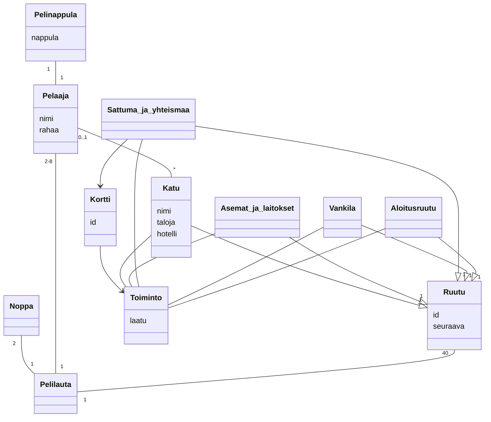

# Monopoli

```mermaid
classDiagram
  Ruutu "40" -- "1" Pelilauta
  Pelaaja "2-8" -- "1" Pelilauta
  Noppa "2" -- "1" Pelilauta
  Pelinappula "1" -- "1" Pelaaja
  Aloitusruutu --|> "1" Ruutu
  Aloitusruutu -- Toiminto
  Vankila --|> "1" Ruutu
  Vankila -- Toiminto
  Sattuma_ja_yhteismaa --|> "1" Ruutu
  Sattuma_ja_yhteismaa -- Toiminto
  Asemat_ja_laitokset --|> "1" Ruutu
  Asemat_ja_laitokset -- Toiminto
  Katu --|> "1" Ruutu
  Katu -- Toiminto
  Sattuma_ja_yhteismaa --> Kortti
  Kortti --> Toiminto
  Pelaaja "0..1" -- "*" Katu
  class Noppa{

  }
  class Pelaaja{
    nimi
    rahaa
  }
  class Pelilauta{
  
  }
  class Ruutu{
    id
    seuraava
  }
  class Pelinappula{
    nappula
  }
  class Aloitusruutu{
  
  }
  class Vankila{
  
  }
  class Sattuma_ja_yhteismaa{
  
  }
  class Asemat_ja_laitokset{
  
  }
  class Katu{
    nimi
    taloja
    hotelli
  }
  class Kortti{
    id
  }
  class Toiminto{
    laatu
  }
```
