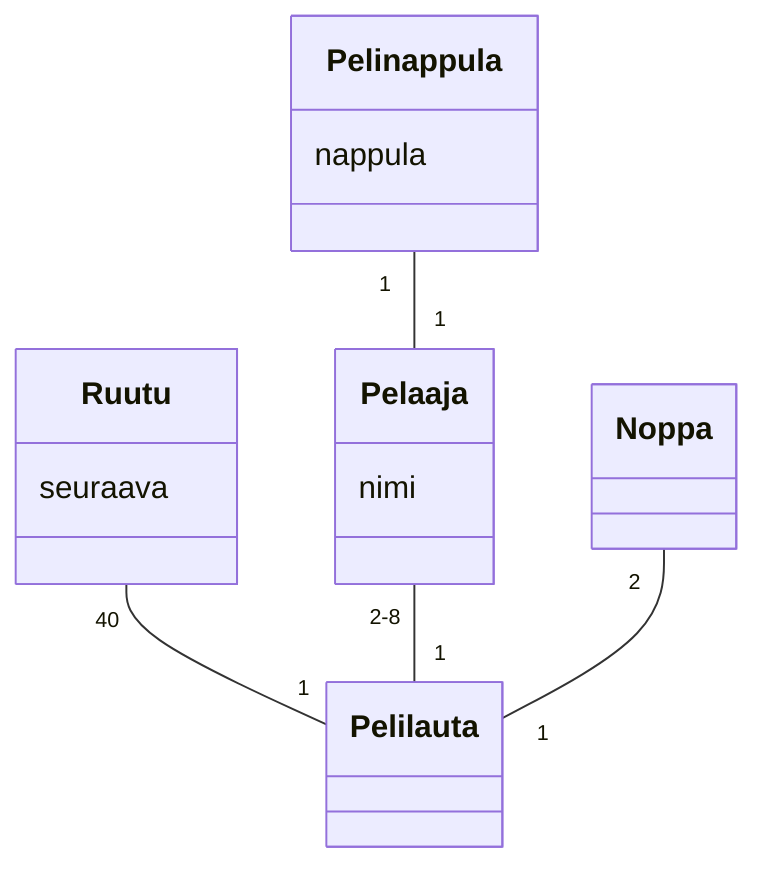

# Monopoli

```mermaid
classDiagram
  Ruutu "40" -- "1" Pelilauta
  Pelaaja "2-8" -- "1" Pelilauta
  Noppa "2" -- "1" Pelilauta
  Pelinappula "1" -- "1" Pelaaja
  class Noppa{

  }
  class Pelaaja{
    nimi
  }
  class Pelilauta{
  
  }
  class Ruutu{
    seuraava
  }
  class Pelinappula{
    nappula
  }
  
```
