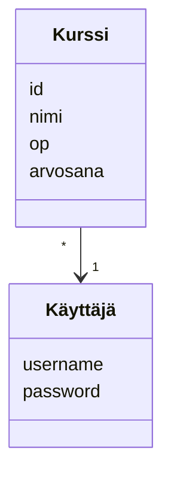

## Käyttöliittymä

Lopullisessa sovelluksess on 5 eri näkymää.

- Sisään kirjautuminen

- Rekisteröityminen

- Kurssien perusnäkymä

- Kurssin lisäys

- Kurssin muokkaus

## Tietojen tallennus

Sovellus tallentaa tiedot tietokantaan, jossa on 2 taulua seuraavasti:

## Pakkauskaavio

Sovellus on tehty kerrosarkkitehtuurin idealla, jakamalla seuraaviin kokonaisuuksiin:

- ui

- services

- entities

- repositories
