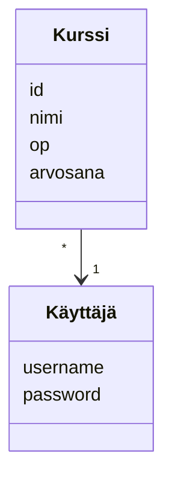
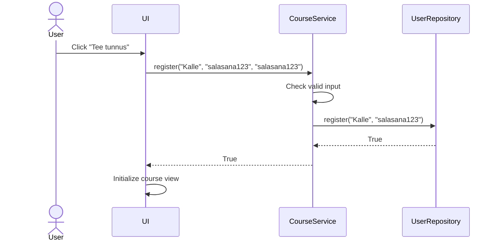
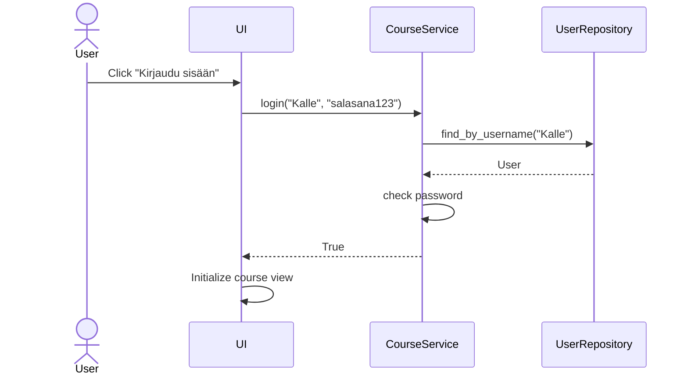
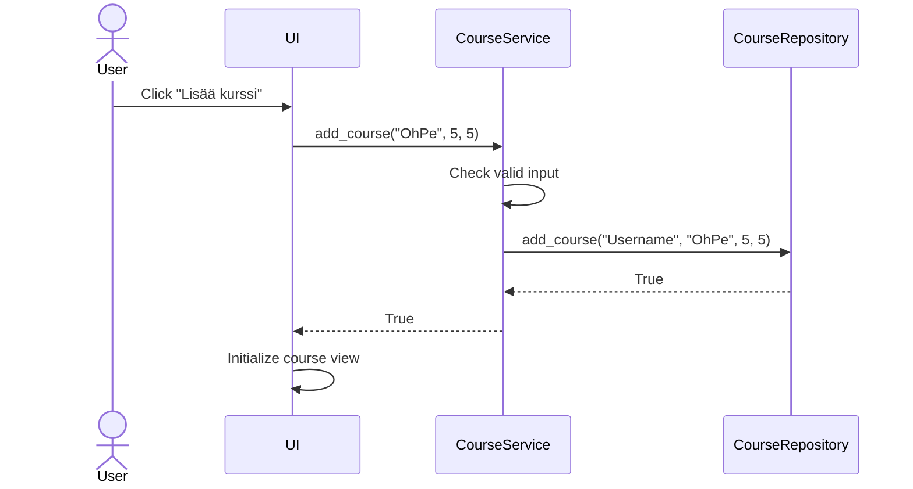

## Käyttöliittymä

Sovelluksessa on 6 eri näkymää.

- Sisäänkirjautuminen

- Rekisteröityminen

- Kurssien perusnäkymä

- Kurssin lisäys

- Kurssin muokkaus

- Virheen ilmoitus

Jokainen näkymä on tehty omana luokkanaan. Sovelluksessa on aina näkyvillä vain yksi näkymä kerrallaan, jonka näyttämisestä ja vaihtamisesta vastaa UI luokka. Käyttöliittymä vastaa vain näkymistä, eikä se juurikaan sisällä sovelluslogiikkaa, joka hoidetaan CourseService luokan kautta.

## Tietojen tallennus

Sovellus tallentaa tiedot SQLite tietokantaan, jossa on 2 taulua seuraavasti:

Tietokanta alustetaan initialize_database.py-tiedostossa, ja sen käyttämisestä vastaavat luokat CourseRepository ja UserRepository.

## Luokkakaavio

Sovellus on tehty kerrosarkkitehtuurin idealla, jakamalla seuraaviin kokonaisuuksiin:

- ui

- services

- entities

- repositories

## Päätoiminnallisuudet

#### Uuden käyttäjän rekisteröiminen

Näkymässä käyttäjä syöttää käyttäjätunnuksen, sekä salasanan 2 kertaa. Kun käyttäjä painaa "Tee tunnus" Sovellus toimii seuraavasti:

Sovellus tarkastaa aluksi, onko käyttäjän syötteissä virheitä. Jos ei ole, sovellus tallentaa tietokantaan uuden käyttäjän ja siirtyy kurssinäkymään.

#### Sisäänkirjautuminen

Kun käyttäjä on kirjautuu sisään, etenee sovellus seuraavasti:

Sovellus hakee aluksi tietokannasta, onko käyttäjää olemassa. Jos käyttäjä on olemassa tarkastetaan, että salasana on oikea, jonka jälkeen siirrytään kurssinäkymään.

#### Kurssin lisääminen

