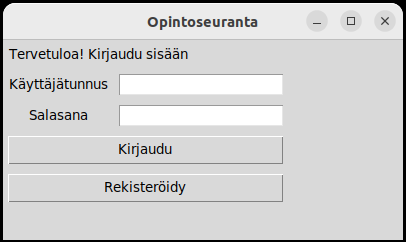
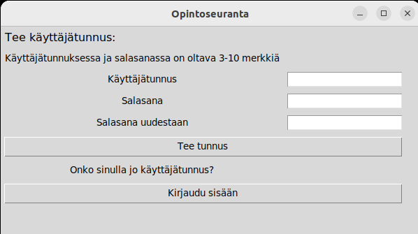
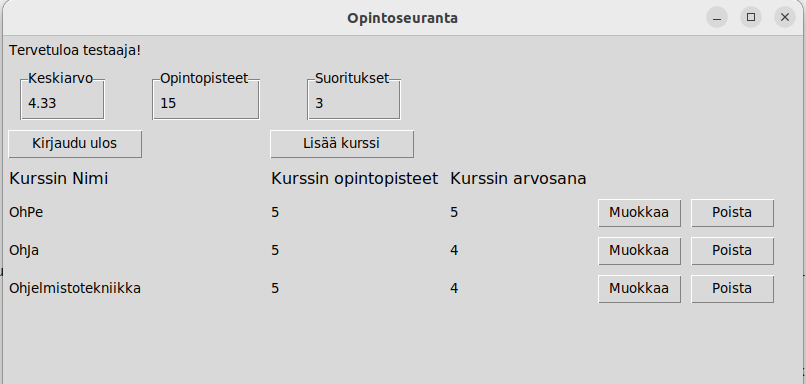
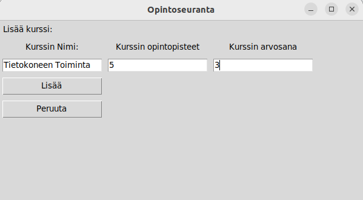
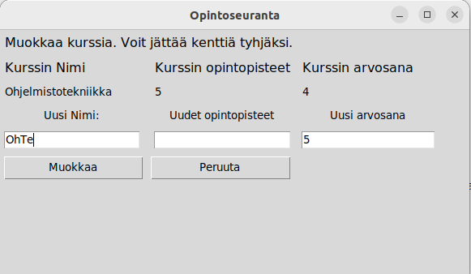

# Käyttöohje

## Ohjelman käynnistäminen

Aloita asentamalla sovelluksen riippuvuudet komennolla 

```Poetry install```

Seuraavaksi alusta tietokanta komennolla

```Poetry run invoke build```

Nyt ohjelman saa käynnistettyä komennolla 

```Poetry run invoke start```

## Kirajutuminen

Sovellukseen voi kirajutua olemassa olevalla käyttäjätunnuksella ja oikealla salasanalla ja painamalla "kirjaudu sisään". 
Vaihtoehtoisesti voit siirtyä rekisteröimään uuden käyttäjän.



## Rekisteröinti

Uuden käyttäjätunnuksen täytyy olla 3 - 10 merkkiä pitkä, eikä sen nimistä käyttäjää saa olla vielä olemassa. Salasanan on oltava 3-10 merkkiä pitkä. 
Uuden käyttäjän rekisteröinti onnistuu painamalla "Tee tunnus". Vaihtoehtoisesti voit palata kirjautumis näkymään painamalla "Kirjaudu sisään".



## Kurssinäkymä

Kirjautumisen jälkeen käyttäjä näkee kaikki suorittamansa kurssit, sekä niiden yhteenvedon. Uusia kursseja voi lisätä painamalla "Lisää kurssi". 
Olemassa olevia kursseja voi myös muokata ja poistaa. Käyttäjä voi kirjautua ulos painamalla "Kirjaudu ulos".



## Uuden kurssin lisääminen

Uuden kurssin lisääminen onnistuu täyttämällä kurssin nimi, opintopisteet, arvosana ja painamalla "Lisää". 
Opintopisteiden tulee olla positiivinen kokonaisluku ja arvosanan täytyy olla kokonaisluku 1-5 välillä.



## Kurssin muokkaaminen

Kursseja voi muokkaa myös lisäämisen jälkeen. Käyttäjä voi syöttää uuden arvon kenttään, tai jättää kentän tyhjäksi. 
Jos kenttä jätetään tyhjäksi, ei sitä muokata.


