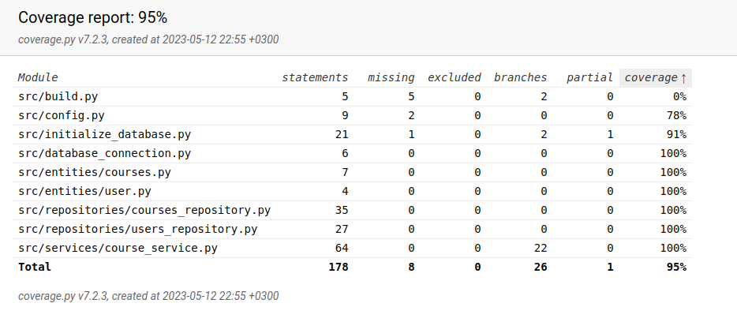

# Testausdokumentti

Ohjelmaa on testattu sekä automatisoiduilla yksikkö- ja integraatiotesteillä käyttäen unittest kirjastoa. Tämän lisäksi sovellusta on myös testattu manuaalisesti käytössä.

## Yksikkö- ja integraatiotestaus

### Sovelluslogiikka

Sovelluslogiikka testataan omalla luokallaan, jonka nimi on TestCourseService.

### Repository-luokat

Repositoria luokkia, eli CourseRepository ja UserRepository luokkia testataan niitä vastaavilla TestCourseRepository ja TestCourseRepository luokilla

## Testikattavuus

Testikattavuuteen ei ole laskettu mukaan käyttöliittymää. Ilman käyttöliittymää, on testien haarautumakattavuus 95%. Build.py tiedostoa ei testattu erikseen.

## Järjestelmätestaus

Sovellusta on myös testattu manuaalisesti. Sovellus ollaan testattu lataamalla se linux-ympäristöön ja käynnistämällä ohjeiden mukaisella tavalla. 
Kaikki sovelluksen toiminnallisuudet ja virheidenkäsittely ollaan myös testattu manuaalisesti.
